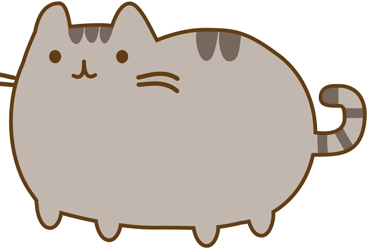

# Level 1 Heading

Here is some text. It's under a heading.

Paragraph 2 

## Level 2 Heading

Here's some *really* **important** text  
1. first thing
2. second thing
3. things

Second paragraph with more stuff
- thing
- things2
- things3

Images 



```
"My stuff here"
```


